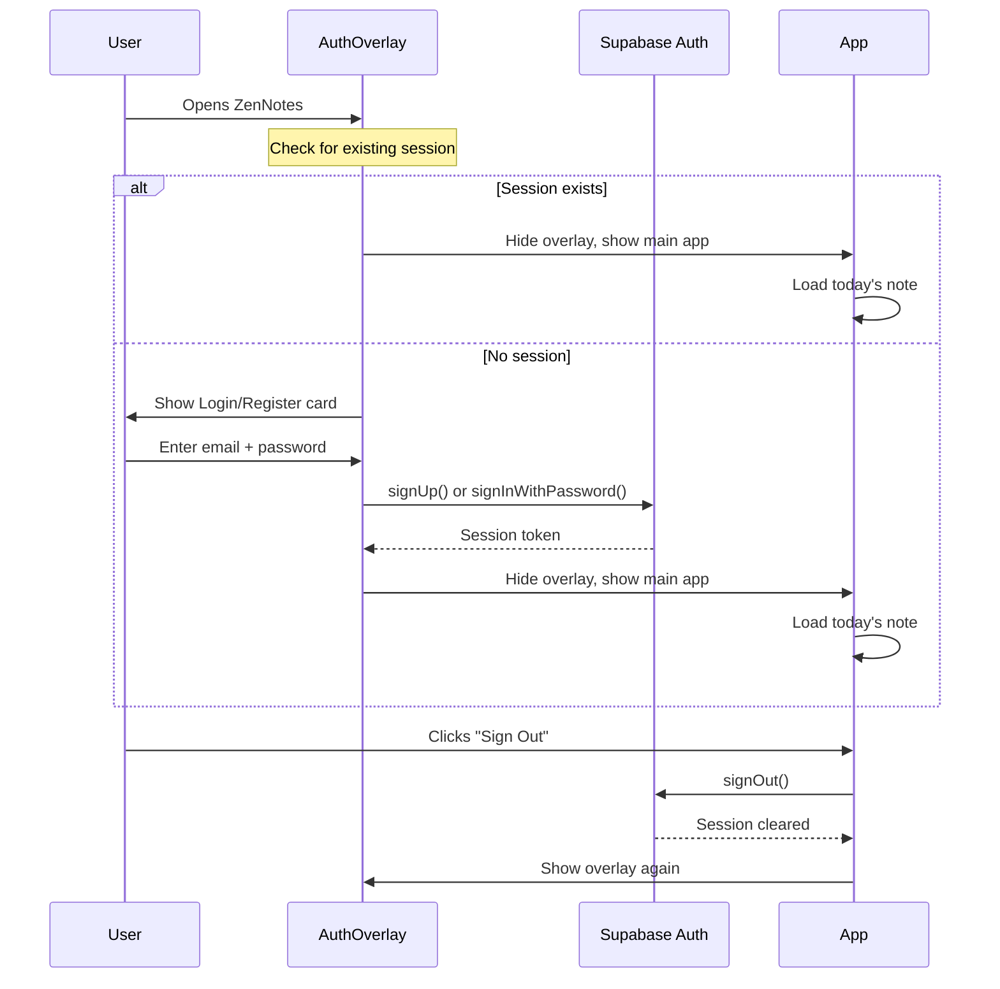
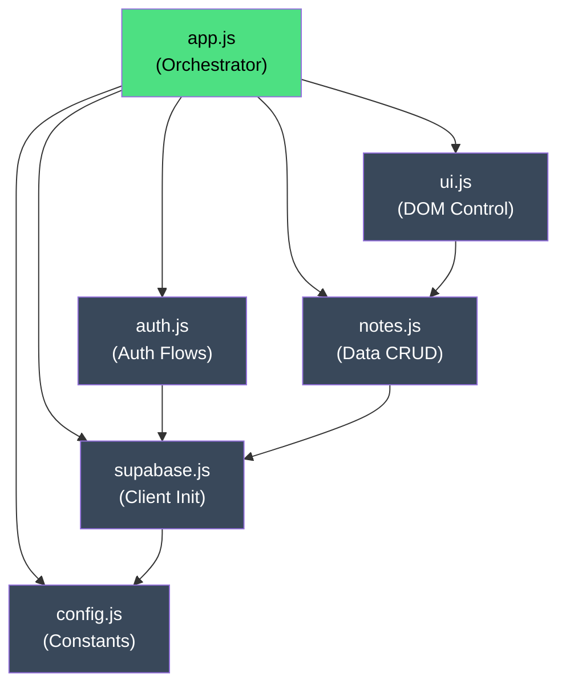
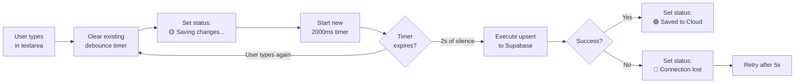

# 🏗️ ZenNotes — Architecture & Implementation Plan

> **Status:** Awaiting Approval  
> **Version:** 1.0  
> **Date:** July 19, 2026

---

## 📐 Design Reference (Google Stitch Prototypes)

````carousel

<!-- slide -->

````

---

## 1. Tech Stack Summary

| Layer | Technology | Rationale |
|---|---|---|
| **Markup** | HTML5 Semantic Elements | SEO-friendly, accessible structure |
| **Styling** | Tailwind CSS v3 (CDN) | Matches Stitch prototype; rapid utility-first styling |
| **Typography** | Google Fonts: Geist + JetBrains Mono | Design spec "Functional Contrast" pairing |
| **Icons** | Material Symbols Outlined | Already used in Stitch prototypes |
| **Logic** | Vanilla JavaScript ES6+ (Modules) | Zero build-step, clean separation of concerns |
| **Backend** | Supabase (PostgreSQL + Auth + Realtime) | Managed BaaS with RLS, Auth, and REST API |
| **Hosting** | Static file serving (any CDN/Netlify/Vercel) | No server required — pure client-side SPA |

---

## 2. Directory Structure

```
stitch_zennotes_minimalist_journaling_app/
├── zennotes/                  # Design doc (existing)
├── zennotes_desktop/          # Stitch prototype (existing)
├── zennotes_mobile/           # Stitch prototype (existing)
│
└── app/                       # 🆕 Production Application Root
    ├── index.html             # Single entry point (SPA shell)
    ├── css/
    │   └── styles.css         # Custom styles, animations, scrollbar overrides
    ├── js/
    │   ├── config.js          # Supabase URL + Anon Key constants
    │   ├── supabase.js        # Supabase client initialization
    │   ├── auth.js            # Login/Register/Logout flows
    │   ├── notes.js           # CRUD operations, debounced upsert, backup
    │   ├── ui.js              # DOM manipulation, sidebar, focus mode, status
    │   └── app.js             # Main orchestrator — init, event binding, routing
    └── supabase/
        └── schema.sql         # DDL + RLS policies (for manual execution)
```

> [!IMPORTANT]
> All JS files use ES6 module syntax (`import`/`export`). The `index.html` loads `app.js` as `type="module"`, which imports all others. **Zero build tools required.**

---

## 3. Supabase Database Schema

### 3.1 Table: `daily_notes`

```sql
-- ============================================
-- ZenNotes Database Schema
-- Execute this in Supabase SQL Editor
-- ============================================

CREATE TABLE IF NOT EXISTS public.daily_notes (
    id          UUID PRIMARY KEY DEFAULT gen_random_uuid(),
    user_id     UUID NOT NULL REFERENCES auth.users(id) ON DELETE CASCADE,
    note_date   DATE NOT NULL DEFAULT CURRENT_DATE,
    content     TEXT,
    updated_at  TIMESTAMPTZ NOT NULL DEFAULT now(),

    -- Enforce one note per user per day
    CONSTRAINT unique_user_date UNIQUE (user_id, note_date)
);

-- Index for fast lookups by user + date
CREATE INDEX IF NOT EXISTS idx_daily_notes_user_date 
    ON public.daily_notes (user_id, note_date DESC);
```

### 3.2 Row Level Security (RLS) Policies

```sql
-- Enable RLS on the table
ALTER TABLE public.daily_notes ENABLE ROW LEVEL SECURITY;

-- Policy: Users can SELECT only their own rows
CREATE POLICY "Users can read own notes"
    ON public.daily_notes FOR SELECT
    USING (auth.uid() = user_id);

-- Policy: Users can INSERT only their own rows
CREATE POLICY "Users can insert own notes"
    ON public.daily_notes FOR INSERT
    WITH CHECK (auth.uid() = user_id);

-- Policy: Users can UPDATE only their own rows
CREATE POLICY "Users can update own notes"
    ON public.daily_notes FOR UPDATE
    USING (auth.uid() = user_id)
    WITH CHECK (auth.uid() = user_id);

-- Policy: Users can DELETE only their own rows
CREATE POLICY "Users can delete own notes"
    ON public.daily_notes FOR DELETE
    USING (auth.uid() = user_id);
```

### 3.3 Auto-Update Trigger for `updated_at`

```sql
-- Function to auto-update the updated_at timestamp
CREATE OR REPLACE FUNCTION public.handle_updated_at()
RETURNS TRIGGER AS $$
BEGIN
    NEW.updated_at = now();
    RETURN NEW;
END;
$$ LANGUAGE plpgsql;

-- Trigger on UPDATE
CREATE TRIGGER set_updated_at
    BEFORE UPDATE ON public.daily_notes
    FOR EACH ROW
    EXECUTE FUNCTION public.handle_updated_at();
```

---

## 4. Authentication Flow



**UI Implementation:**
- A full-screen overlay (`z-50`, `backdrop-blur-xl`) with a centered card
- Card contains: toggle tabs (Login / Register), email input, password input, submit button
- Minimal design: no borders, `bg-surface-container` card, `bg-background/80` overlay
- Error messages appear inline as subtle red text
- On success: overlay fades out with `opacity 0 → pointer-events-none` transition (300ms)

---

## 5. Frontend Component Architecture

### 5.1 Layout Zones

```
┌──────────────────────────────────────────────────────┐
│                  AUTH OVERLAY (z-50)                  │
│            [Login / Register Card]                    │
├──────────┬───────────────────────────────────────────┤
│          │  HEADER BAR                               │
│ SIDEBAR  │  ┌─────────────────────────────────────┐  │
│  (25%)   │  │ Date Title          Status + Sync   │  │
│          │  └─────────────────────────────────────┘  │
│ ┌──────┐ │                                           │
│ │Brand │ │  EDITOR CANVAS (75%)                      │
│ │+ CTA │ │  ┌─────────────────────────────────────┐  │
│ │      │ │  │                                     │  │
│ │ Date │ │  │   <textarea> (max-w-800px)          │  │
│ │ List │ │  │   JetBrains Mono · 18px · 1.8lh     │  │
│ │      │ │  │                                     │  │
│ │      │ │  │                                     │  │
│ │Search│ │  └─────────────────────────────────────┘  │
│ │Backup│ │  FOOTER STATS (word count, char count)    │
│ └──────┘ │                                           │
└──────────┴───────────────────────────────────────────┘
```

### 5.2 Component Inventory

| Component | Element | Key Behaviors |
|---|---|---|
| **Auth Overlay** | `#auth-overlay` | Full-screen blur overlay, Login/Register toggle, form validation |
| **Sidebar** | `#sidebar` | Collapsible (desktop toggle + mobile drawer), history list, search, backup |
| **Sidebar Toggle** | `#sidebar-toggle` | Hamburger icon on mobile, chevron on desktop; animates sidebar width |
| **History List** | `#history-list` | Dynamically rendered from Supabase; active item highlighted |
| **Search Bar** | `#search-input` | Real-time client-side filter over history list items |
| **Header** | `#header` | Date display, cloud status indicator, sync icon, sign-out button |
| **Status Indicator** | `#cloud-status` + `#sync-dot` | Yellow/pulse while saving, green on success, red on error |
| **Editor** | `#zen-editor` | Auto-focus textarea, debounced autosave on input, Tab indent support |
| **Footer Stats** | `#word-count` + `#char-count` | Real-time word/char count, subtle opacity |

### 5.3 Focus Mode Micro-Interaction

```
                  NORMAL STATE                    FOCUS STATE (textarea focused)
            ┌────────────────────┐            ┌────────────────────┐
            │ Sidebar  opacity:1 │            │ Sidebar opacity:0.5│
            │ Header   opacity:1 │    ──►     │ Header  opacity:0.5│
            │ Editor   opacity:1 │            │ Editor  opacity:1  │
            └────────────────────┘            └────────────────────┘
                                                transition: 1s ease
```

---

## 6. JavaScript Module Architecture

### 6.1 Module Dependency Graph



### 6.2 Key Module Responsibilities

#### `config.js`
```javascript
// Exports: SUPABASE_URL, SUPABASE_ANON_KEY
// User must replace these with their Supabase project credentials
```

#### `supabase.js`
```javascript
// Imports config.js
// Creates and exports the Supabase client instance
// Uses: @supabase/supabase-js CDN (esm.sh)
```

#### `auth.js`
```javascript
// Exports: signUp(), signIn(), signOut(), getSession(), onAuthStateChange()
// Handles all Supabase Auth interactions
// Returns user object or throws descriptive errors
```

#### `notes.js`
```javascript
// Exports: fetchTodayNote(), fetchAllNotes(), upsertNote(), downloadBackup()
// All operations scoped to auth.uid() automatically via RLS
// upsertNote uses ON CONFLICT (user_id, note_date)
```

#### `ui.js`
```javascript
// Exports: initUI(), renderSidebar(), updateStatus(), toggleSidebar(),
//          setFocusMode(), renderHistoryList(), filterHistory()
// Pure DOM manipulation — no data fetching
```

#### `app.js`
```javascript
// Main orchestrator — the only <script> tag in index.html
// 1. Initialize Supabase client
// 2. Check auth state → show/hide auth overlay
// 3. On login: fetch today's note, render sidebar history
// 4. Bind event listeners (input debounce, sidebar clicks, search)
// 5. Handle auth state changes (login/logout transitions)
```

### 6.3 Debounced Autosave Flow



---

## 7. Responsive Behavior

| Breakpoint | Sidebar | Header | Editor |
|---|---|---|---|
| **Desktop** (≥1024px) | Visible, 25% width, collapsible via toggle | Full date title + status | Max-width 800px, centered |
| **Tablet** (768–1023px) | Hidden by default, overlay drawer | Compact date + status | Full width with padding |
| **Mobile** (<768px) | Hidden by default, 75% width overlay drawer | Abbreviated date, stacked layout | Full width, 24px margins |

---

## 8. Phased Implementation Plan

### Phase 1: Project Scaffolding & Static Shell
- [x] Analyze Stitch prototypes ✅
- [ ] Create `/app` directory structure
- [ ] Create `index.html` with full Tailwind-configured markup
- [ ] Create `css/styles.css` with custom animations and scrollbar overrides
- [ ] Verify static shell renders correctly in browser

### Phase 2: Supabase Setup
- [ ] Generate `supabase/schema.sql` with DDL + RLS + triggers
- [ ] Create `js/config.js` with placeholder credentials
- [ ] Create `js/supabase.js` client initialization

### Phase 3: Authentication System
- [ ] Build auth overlay UI (Login/Register card)
- [ ] Implement `js/auth.js` with signUp, signIn, signOut
- [ ] Wire auth state change listener in `app.js`
- [ ] Test login → app transition and logout → overlay transition

### Phase 4: Core CRUD & Autosave
- [ ] Implement `js/notes.js` — fetchTodayNote, fetchAllNotes, upsertNote
- [ ] Implement 2000ms debounced autosave on textarea input
- [ ] Implement dynamic cloud status indicator (yellow/green/red states)
- [ ] Test autosave cycle end-to-end

### Phase 5: Sidebar, History & Search
- [ ] Dynamic sidebar rendering from fetched notes
- [ ] Click-to-load: sidebar item → loads that date's content into editor
- [ ] Active state highlighting for current date
- [ ] Real-time keyword search filter at sidebar bottom
- [ ] "Download Backup" → exports all user notes as `.json`

### Phase 6: Polish & Micro-Interactions
- [ ] Focus mode (opacity dim on sidebar + header when editor focused)
- [ ] Sidebar collapse animation (desktop toggle + mobile drawer)
- [ ] Word/character count footer (real-time)
- [ ] Tab-to-indent support in textarea
- [ ] Scroll-based header opacity fade
- [ ] Custom zen cursor animation
- [ ] Final responsive QA across breakpoints

---

## 9. Security Considerations

| Concern | Mitigation |
|---|---|
| **API Key Exposure** | Supabase anon key is designed to be public; all security enforced via RLS |
| **XSS Protection** | No `innerHTML` for user content; `textContent` only |
| **Data Isolation** | RLS policies ensure `auth.uid() = user_id` on all operations |
| **Session Management** | Supabase handles JWT refresh automatically via client library |
| **Input Validation** | Content is `TEXT` type — no injection risk with parameterized queries |

---

## 10. Configuration Checklist (User Action Required)

> [!CAUTION]
> Before deploying, you must complete these steps in your Supabase dashboard:

1. **Create a new Supabase project** at [supabase.com](https://supabase.com)
2. **Run the SQL schema** from `supabase/schema.sql` in the SQL Editor
3. **Copy your credentials** from Settings → API:
   - `Project URL` → paste into `js/config.js` as `SUPABASE_URL`
   - `anon/public` key → paste into `js/config.js` as `SUPABASE_ANON_KEY`
4. **Enable Email Auth** in Authentication → Providers → Email (enabled by default)
5. **(Optional)** Disable email confirmation for development: Authentication → Settings → toggle off "Enable email confirmations"

---

> [!IMPORTANT]
> **Awaiting your approval** to proceed with full code implementation. Once confirmed, I will execute Phases 1–6 sequentially and deliver the complete, working codebase with a browser walkthrough.
